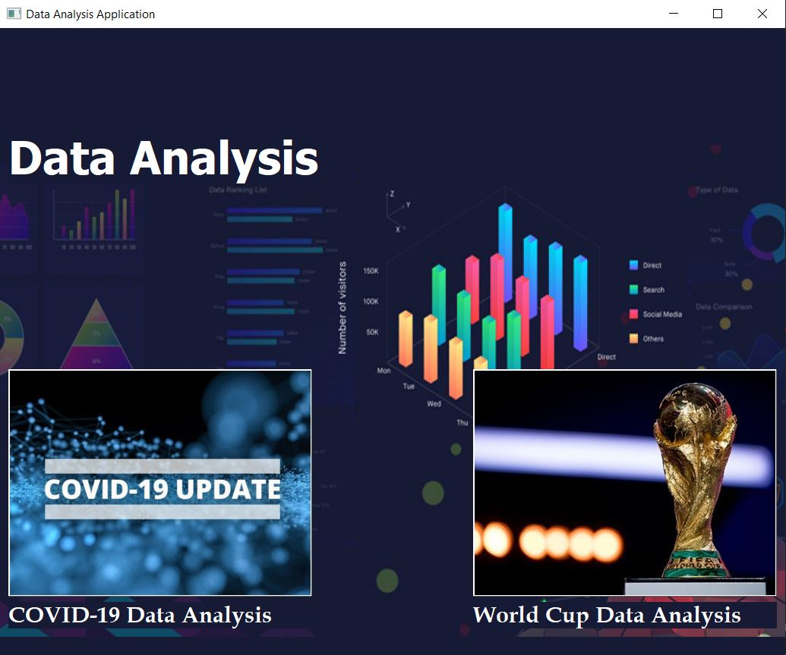
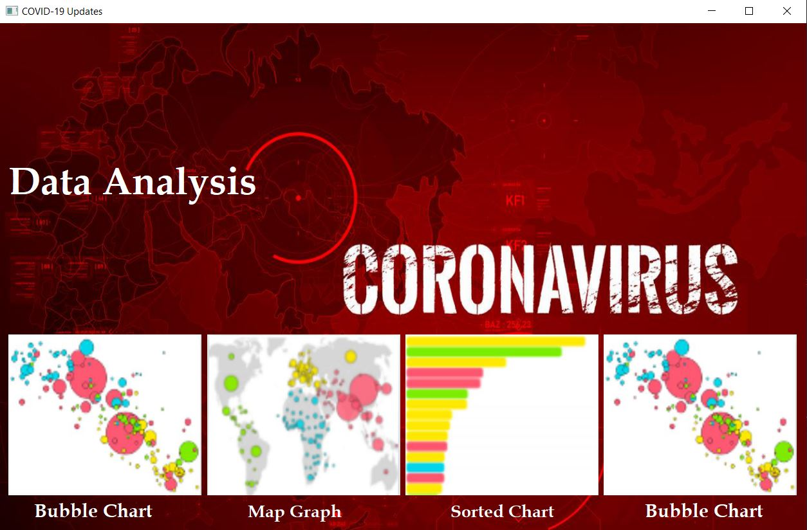
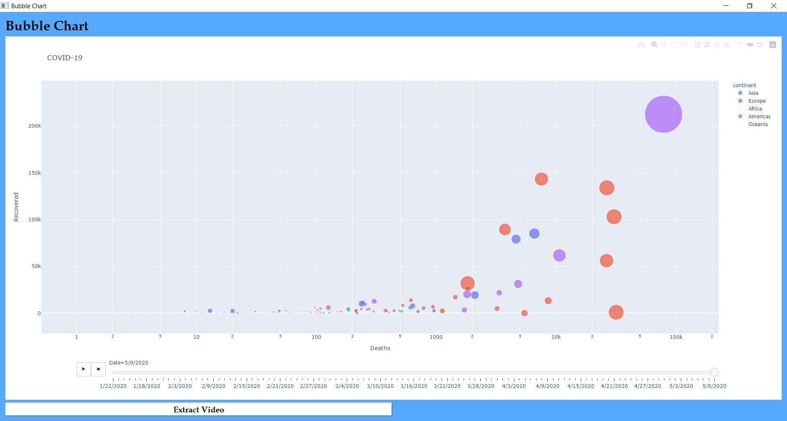
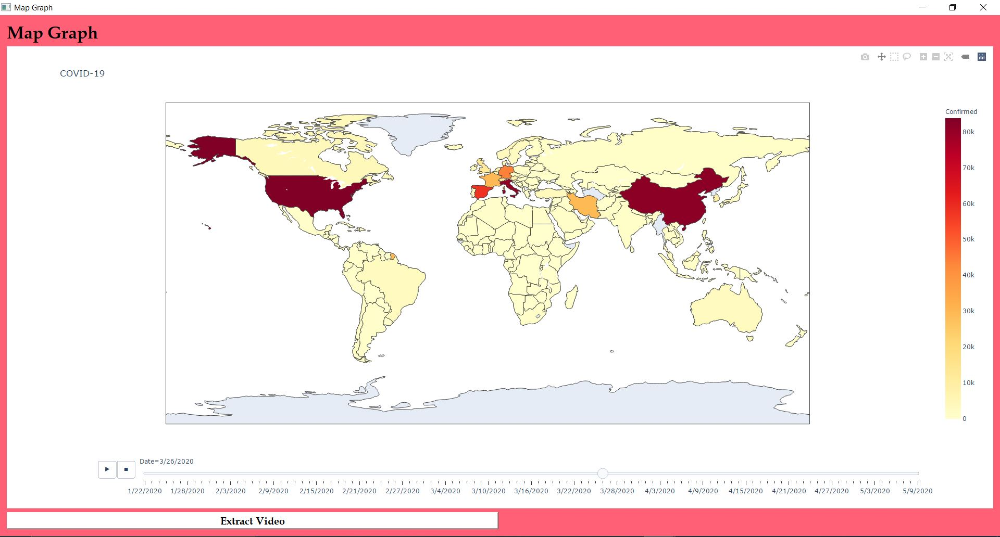
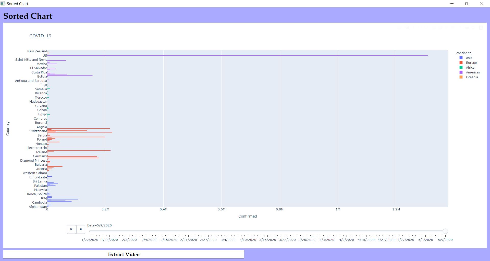
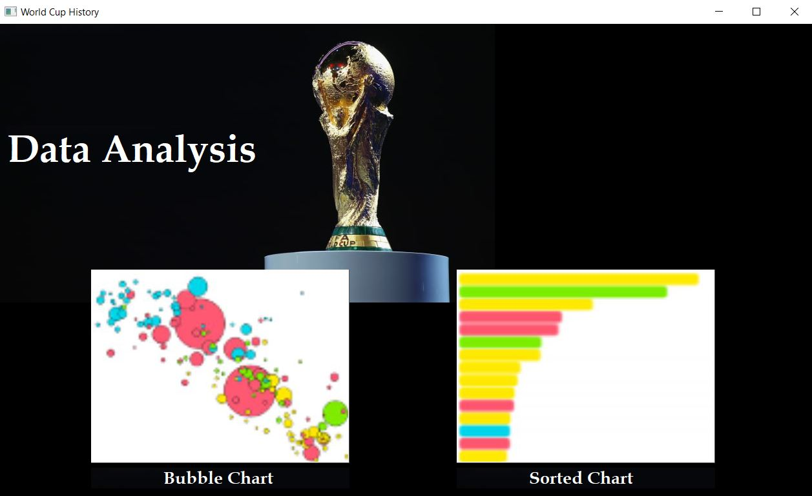
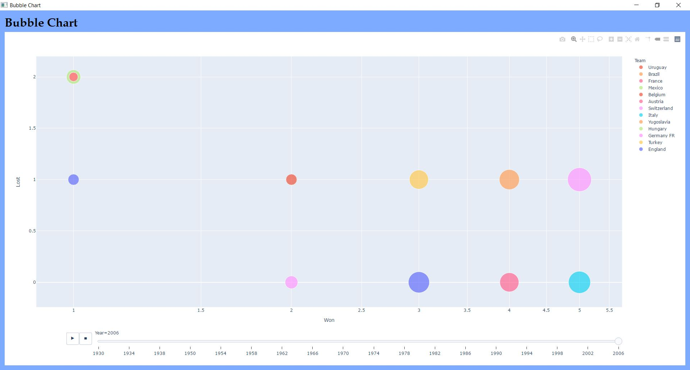
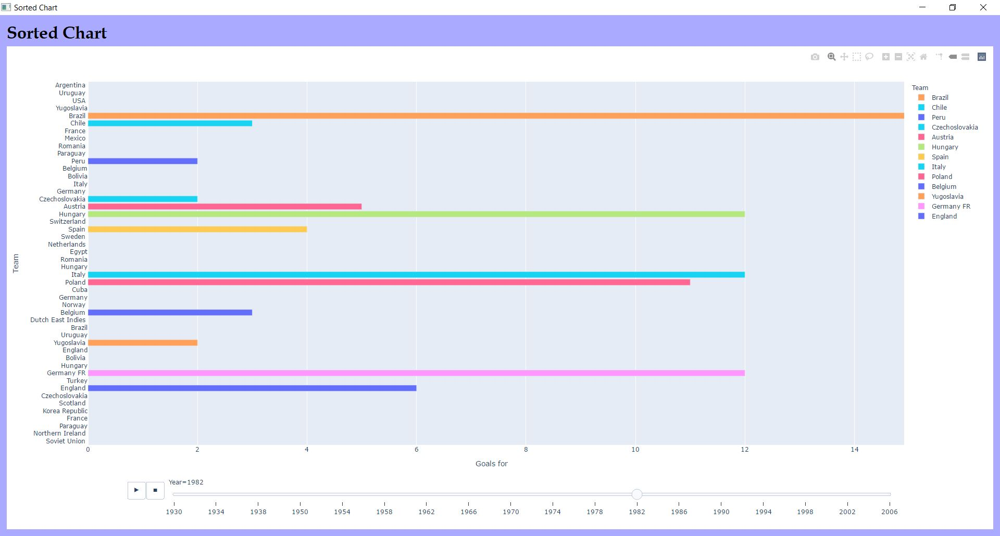

# Data-Analysis-App

## Author

- Mohamed Ahmed

---

## Introduction

This application for data analysis; Data analysis can be implemented in different ways as Bubble graphs, Map graphs and Sorted list. This application has datasetes for COVID-19 Virus and World Cup(additional and not required).

---

## Code Implementation "Highlights"

- Application developed to visualize different animated graphs by Plotly library.
- **htmlConverter** function implemented for plotting graph withing Html and Python. .
- Instead of run it in local host server **QWebEngineView** used for adding Html "returning from htmlConverter" to be plotted.

---

## How Application works

User Can choose which Data Analysis to show.

### **FIRST**: COVID-19 Data Analysis Tab

User Can visualize Data Analysis in different ways as Animated Bubble Chart, Animated Map Graph and Animated Sorted Chart.

### **Animated Graphs**

|               Bubble Chart               |               Map Graph               |
| :--------------------------------------: | :-----------------------------------: |
|  |  |

|               Sorted Chart               |               Bubble Chart               |
| :--------------------------------------: | :--------------------------------------: |
|  |  |

### **SECOND**: World Cup Data Analysis Tab

User Can visualize Data Analysis in different ways as Animated Bubble Chart and Animated Sorted Chart.

### **Animated Graphs**

|               Bubble Chart               |               Map Graph               |
| :--------------------------------------: | :-----------------------------------: |
|  |  |

### **_Application Features_**

User can extract plot as Video by Extract Video Button

---

## Conclusion

Data is the most crucial factor to overcome the pandemic. It is important
not only to collect the data but rather to visualize it in a way that would help decision makers to grasp the underlying
information.

---
